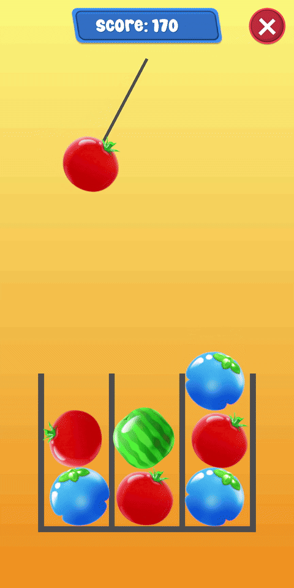

# Test_Pendulum

This project was made for a test task. It took about 10 hours to make.

  

## Installation

#### Requirements:

- Unity 2022.3+
- Input System
- Visual Effect Graph
- TextMeshPro
- ZenJect

#### Install project:

1. Clone this repo
1. Open `Assets/Scenes/Bootstrap.unity` scene to start the game.

#### Install project (using .unitypackage):

1. Download the [Test_Pendulum.unitypackage](https://github.com/WiLLLLL683/Test_Pendulum/releases/latest/download/Test_Pendulum.unitypackage) 
file from latest release. 
2. Open Test_Pendulum.unitypackage.
3. Open `Assets/Scenes/Bootstrap.unity` scene to start the game.

## How to play

#### Install game (using .apk)

1. Download the [Test_Pendulum.apk](https://github.com/WiLLLLL683/Test_Pendulum/releases/latest/download/Test_Pendulum.apk) 
file from latest release.
2. Install in on your device.
3. Run the game.
4. Tap touchscreen to drop balls into a level.